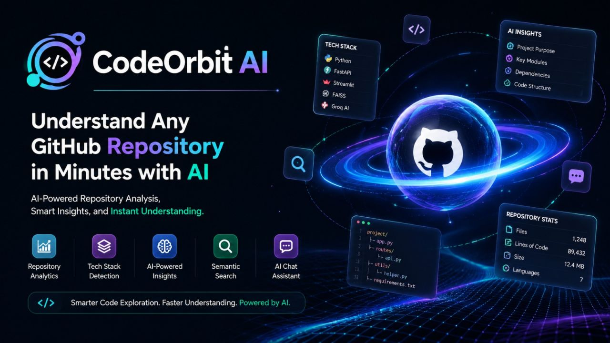

# 🚀 CodeOrbit AI

> **An AI-powered GitHub Repository Intelligence Assistant built using Large Language Models (LLMs), LangChain, FastAPI, FAISS, and Streamlit.**  
> Understand any GitHub repository in minutes, not hours.
> 🏆 Built during the **IBM Bob × lablab.ai Hackathon** using **LangChain, OpenAI GPT-4, FAISS, FastAPI, and Streamlit** to simplify GitHub repository understanding through AI-powered analysis.

<p align="center">



</p>

[](https://www.python.org/downloads/)
[](https://fastapi.tiangolo.com/)
[](https://streamlit.io/)
[](LICENSE)

Built for the **IBM Bob × lablab.ai Hackathon** 🏆

---

## 🎯 Problem Statement

Developers waste countless hours:
- 📚 Understanding unfamiliar codebases
- 🔍 Searching for specific functionality
- 📝 Writing documentation
- 👥 Onboarding new team members
- 🔎 Reviewing pull requests

**Existing AI coding assistants generate code but lack deep repository understanding.**

---

## 💡 Our Solution

CodeOrbit AI is an intelligent assistant that:

✅ **Analyzes** any GitHub repository in minutes  
✅ **Explains** architecture and code structure  
✅ **Answers** questions about the codebase  
✅ **Generates** documentation automatically  
✅ **Reviews** pull requests for risks  
✅ **Guides** new developers through onboarding  

---

## ✨ Key Features

### 🔍 Repository Analysis
- Clone and parse any public GitHub repository
- Extract code structure, dependencies, and patterns
- Identify entry points and key files
- Generate comprehensive statistics

### 💬 Intelligent Chat
- Ask questions about the codebase in natural language
- Get context-aware answers with code examples
- Retrieve relevant code snippets automatically
- Maintain conversation history

### 📝 Documentation Generation
- Auto-generate README files
- Create onboarding guides for new developers
- Generate API documentation
- Export in multiple formats (Markdown, PDF, HTML)

### 🔎 PR Analysis (Coming Soon)
- Analyze pull requests for potential issues
- Detect security vulnerabilities
- Identify performance bottlenecks
- Suggest improvements

---

## 🏆 Hackathon

This project was developed as part of the **IBM Bob × lablab.ai Hackathon**.

The goal was to build an AI-powered solution that helps developers understand unfamiliar GitHub repositories through intelligent code analysis, repository chat, automated documentation generation, and developer onboarding.

The project demonstrates practical applications of Large Language Models (LLMs), Retrieval-Augmented Generation (RAG), semantic search, and modern AI development tools.

## 🏗️ Architecture

```
┌─────────────────┐
│   Streamlit UI  │ ← User Interface
└────────┬────────┘
         │
         ▼
┌─────────────────┐
│  FastAPI Server │ ← Core Processing
└────────┬────────┘
         │
    ┌────┴────┬──────────┬──────────┐
    ▼         ▼          ▼          ▼
┌────────┐ ┌──────┐ ┌────────┐ ┌──────────┐
│ GitHub │ │ FAISS│ │LangChain│ │ OpenAI  │
│  API   │ │  DB  │ │ Agents │ │   API   │
└────────┘ └──────┘ └────────┘ └──────────┘
```

### Tech Stack

**Frontend:**
- 🎨 Streamlit - Interactive web interface
- 📊 Plotly - Data visualization

**Backend:**
- ⚡ FastAPI - High-performance API server
- 🐍 Python 3.9+ - Core language

**AI & ML:**
- 🤖 LangChain - LLM orchestration
- 🧠 OpenAI GPT-4 - Language model
- 📚 FAISS - Vector similarity search
- 🔤 OpenAI Embeddings - Text embeddings

**Repository Management:**
- 📦 GitPython - Git operations
- 🌳 Tree-sitter - Code parsing

---

## 🚀 Quick Start

### Prerequisites

- Python 3.9 or higher
- OpenAI API key
- Git installed


## 📖 Usage

✔ Codebase Search

✔ Semantic Search

✔ Embedding-based Retrieval

✔ Context-aware Chat

✔ Repository Statistics

✔ Architecture Analysis

✔ Intelligent Documentation

✔ Developer Onboarding

## 🎓 Learning Outcomes

- Built a Retrieval-Augmented Generation (RAG) application.
- Worked with Large Language Models.
- Implemented semantic search using FAISS.
- Integrated FastAPI with Streamlit.
- Developed AI-powered developer tools.
- Improved understanding of repository intelligence systems.

## Live Demo

Backend - https://code-orbit-ai.onrender.com/
Frontend - https://codeorbitai-aadj9flhdqzs2ntljrrr79.streamlit.app/


---

## 📝 License

This project is licensed under the MIT License - see the [LICENSE](LICENSE) file for details.

---


## 🙏 Acknowledgments

- **IBM Bob** - For the amazing AI capabilities
- **lablab.ai** - For organizing the hackathon
- **OpenAI** - For GPT-4 and embeddings
- **FastAPI** - For the excellent framework
- **Streamlit** - For rapid UI development
- **LangChain** - For LLM orchestration

---

## 📧 Contact

- **Email:** harmaienmalika@gmail.com

- **LinkedIn:** linkedin.com/in/malika-harmaien

---

<div align="center">

**Made with 🚀 for developers, by developers**

</div>
